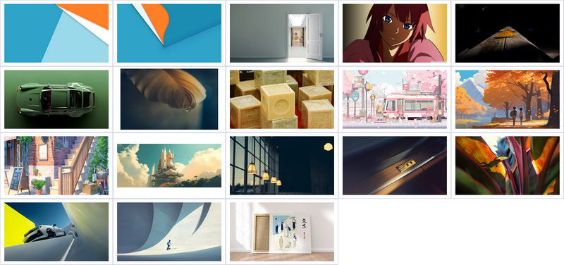

   

   

### Wallpapers   

1920x1080 px   
2560x1440 px    
3840x2160 px   

### Dots   
Copy the .config folder to the home directory.   

### Fonts   

```
JetBrains Mono   
iA Writer Duo S   

Symbols Nerd Font   
Terminess Nerd Font   
JetBrainsMono Nerd Font
```   

### Icons   

```
Tela   
Gruvbox Plus   
Minty   
Monday
```
### Themes   

```
Juno   
Otis   
Zorin Blue   
Gruvbox Medium Borderless
```   

### Cursors   

```
OpenZone_White   
OpenZone_Black
```   
Set in the icons/default/index.theme, .xprofile, .Xresources, .gtk3, .gtk4   

### Distro   

```
Arch   
Alpine   
Debian   
Gentoo   
Crux   
Void
```   