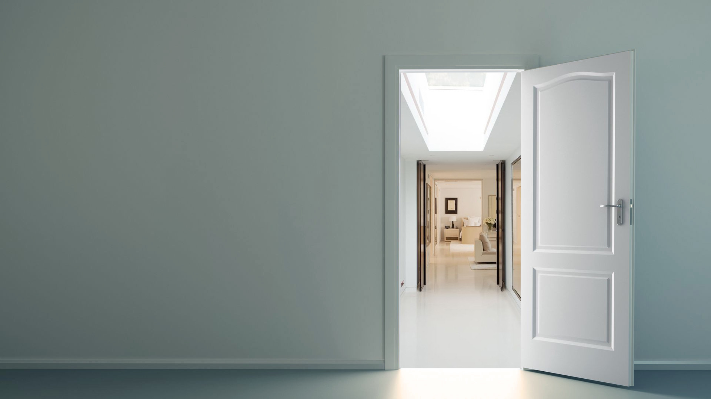

   

    

### Wallpapers
Wallpapers in different resolutions: from 1920x1080px to 3840x2160px. 

### Dots  
Copy the .config folder to the home directory. 

### Fonts
Copy the .local folder to the home directory.  
Run in terminal for reload fonts.  

`
sudo fc-cache -f -v
`    
Select font in the setings.

### Icons 
Copy the .icons folder to the home directory.  
Extract all *.tar.xz archives.  
Select the icons in the setings.

### Themes 
Copy the .icons folder to the home directory.  
Extract all *.tar.xz archives.   
Select the theme in the setings.  

### Cursors
Default cursor theme - OpenZone_White
Set in the icons/default/index.theme, .xprofile, .Xresources, .gtk3, .gtk4

### Distro   
Some Linux commands by distros.