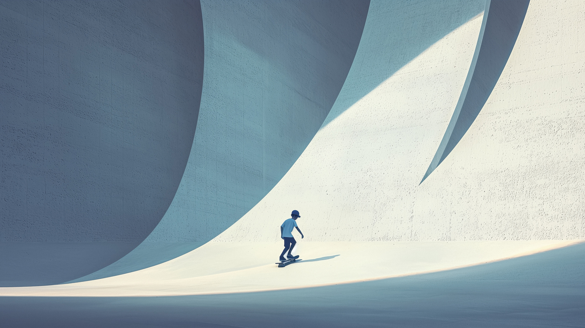

### Wallpapers

Wallpapers in different resolutions: from 1920x1080px to 3840x2160px. Copy in the home directory. Select wallpaper in the setings.

### Music
 
Audio files in different formats: ogg, pls radio stations, flac. Copy in the home directory. 

### Video

Video files in different formats: mp4, mkv. Copy in the home directory.

All rights reserved to their respective authors.   
Posted for audio and video testing purposes only.

### configs / dots  

Copy the .config folder in the home directory. 

### fonts

Copy the .local folder in the home directory.  
Run in terminal for reload fonts.  

`
sudo fc-cache -f -v
`   
 
Select font in the setings.

### icons 

Copy the .icons folder in the home directory.  
Extract all *.tar.xz archives.  
Select the icons in the setings.

### themes

Copy the .icons folder in the home directory.  
Extract all *.tar.xz archives.   
Select the theme in the setings.