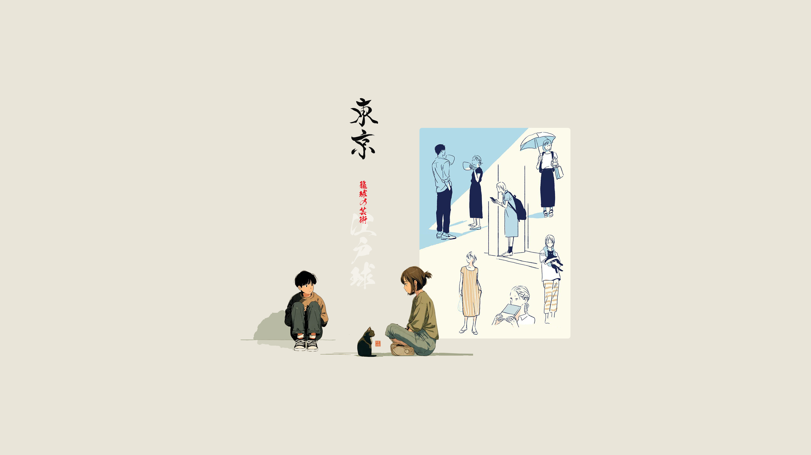

<h1 align="center">

Linux Dotfiles   


###

 

</h1>

### Wallpapers   

1920x1080 px   
2560x1440 px    
3840x2160 px   

### Dotfiles   
All dotfiles inside .config folder.   

### Normal Fonts   
```
Iosevka   
JetBrains Mono   
iA Writer Duo S
```   

### Nerd Fonts   

```
FantasqueSans Mono   
Terminess Nerd Font   
JetBrainsMono Nerd Font
```   

### Icon Fonts   

```
Material Symbols
Symbols Nerd Font Mono
```   

### Boot Fonts   

```
Terminus   
```   

### Icons   

```
Papirus   
Gruvbox
```   

### Themes   

```
Gruvbox   
Kanagawa   
Catppuccin Frappe
```   

### Cursors   

```
Breeze Black   
Bibata White
```   
Set in the .xprofile, .Xresources, .gtk3, .gtk4   

### Distro   

Different commands for distros.   

```
Crux   
Arch   
Alpine   
Debian   
Gentoo   
```   